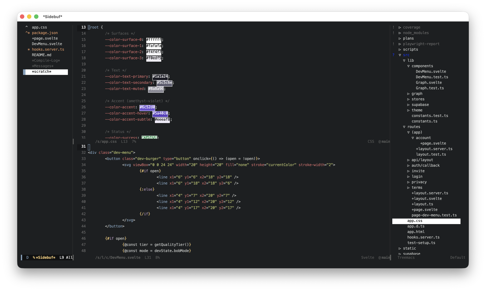

# Sidebuf

[](https://melpa.org/#/sidebuf)
[](https://www.gnu.org/licenses/gpl-3.0)

A simple, zero-dependency buffer list sidebar for Emacs.

Sidebuf displays a persistent, sorted list of your open buffers in a side window. It tracks the active buffer, lets you pin favorites to the top, and provides quick toggles for filtering and sorting, all in about 400 lines of Elisp with no external dependencies.


_(sidebuf panel on the left window)_

## Features

- **Pinned sidebar** -- always-visible buffer list on the left or right
- **Alphabetical or recent** sort order, toggled with `s`
- **Pin buffers** to the top of the list with `i`
- **Filter** `*special*` and hidden buffers on the fly
- **Smart selection** -- reuses an existing window if the buffer is already displayed
- **Display without switching** -- preview a buffer with `o`
- **Modified/read-only indicators** next to buffer names
- **Active-buffer tracking** with fringe indicator
- **Kill buffers** from the sidebar with `k`
- **Jump in and out** of the panel with a single keychord (`sidebuf-select-window`)

## Installation

### From source (use-package)

Clone the repo and point `use-package` at it:

```elisp
(use-package sidebuf
  :load-path "~/sidebuf"
  :commands (sidebuf-open sidebuf-close sidebuf-toggle))
```

### MELPA

Sidebuf is available on [MELPA](https://melpa.org/#/sidebuf):

```elisp
(use-package sidebuf
  :ensure t
  :commands (sidebuf-open sidebuf-close sidebuf-toggle))
```

## Usage

| Command                 | Description                       |
|-------------------------|-----------------------------------|
| `sidebuf-toggle`        | Open or close the panel           |
| `sidebuf-open`          | Open the panel                    |
| `sidebuf-close`         | Close the panel                   |
| `sidebuf-select-window` | Jump to the panel, or back out    |

Press `?` inside the panel to see all keybindings:

```
Navigation:
  p, C-p, up, left     Previous buffer
  n, C-n, down, right  Next buffer

Actions:
  RET                  Select buffer (smart window reuse)
  o                    Display buffer (keep focus here)
  k                    Kill buffer at point
  i                    Pin/unpin buffer at point
  g                    Refresh buffer list

Toggles:
  s                    Toggle sort (alphabetical / recent)
  *                    Toggle *special* buffer visibility
  .                    Toggle hidden buffer visibility

Other:
  ?                    Show this help
  q                    Close sidebuf panel
```

### Jumping to and from the panel

`sidebuf-select-window` jumps the cursor straight into the panel from whatever window you are in, opening the panel first if it is not already visible. Run it again while you are in the panel and it jumps back to the window you came from. One key therefore toggles between your work and the buffer list, inspired by [Treemacs](https://github.com/Alexander-Miller/treemacs)' `treemacs-select-window`.

It is deliberately **not bound to any key by default**, so it never clobbers a binding you already use. Bind it to a global key of your choosing. With plain Emacs:

```elisp
(global-set-key (kbd "C-c b") #'sidebuf-select-window)
```

Or with `use-package`:

```elisp
(use-package sidebuf
  :ensure t
  :commands (sidebuf-open sidebuf-close sidebuf-toggle)
  :bind ("C-c b" . sidebuf-select-window))
```

(`C-c b` is just a suggestion, feel free to use any keychord you like.)

## Customization

All options are in the `sidebuf` customization group (`M-x customize-group sidebuf`):

| Variable                    | Default        | Description                                |
|-----------------------------|----------------|--------------------------------------------|
| `sidebuf-side`              | `left`         | Panel placement (`left` or `right`)        |
| `sidebuf-width`             | `24`           | Panel width in characters                  |
| `sidebuf-show-special`      | `t`            | Show `*special*` buffers                   |
| `sidebuf-show-hidden`       | `nil`          | Show hidden (space-prefixed) buffers       |
| `sidebuf-sort-order`        | `alphabetical` | `alphabetical` or `recent`                 |
| `sidebuf-pin-new-position`  | `bottom`       | Where new pins go (`top` or `bottom`)      |
| `sidebuf-show-indicators`   | `t`            | Show modified/read-only markers            |

## Faces

| Face                         | Purpose                              |
|------------------------------|--------------------------------------|
| `sidebuf-hl-line`            | Current line when panel is focused   |
| `sidebuf-hl-line-inactive`   | Current line when panel is unfocused |
| `sidebuf-fringe-indicator`   | Fringe indicator color               |
| `sidebuf-pinned`             | Pinned buffer names                  |
| `sidebuf-special`            | `*Special*` buffer names             |
| `sidebuf-hidden`             | Hidden (space-prefixed) buffer names |
| `sidebuf-modified`           | Modified indicator                   |

## Requirements

Emacs 27.1 or later. No external dependencies.

## License

GPL-3.0-or-later. See [LICENSE](LICENSE).
